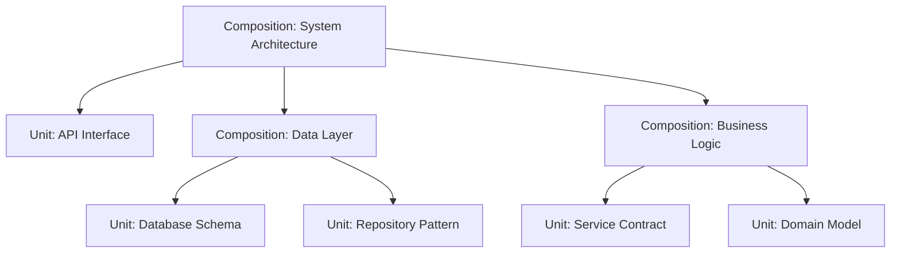

id: "composition-definition"
composition-type: "concept"
brief: "Definition of what constitutes a composition in MDMD"
---
A composition in MDMD represents conceptual groupings, interactions, and
architectural relationships between units and other compositions. Compositions
provide the structural context that organizes atomic units into coherent systems.

Compositions are designed to be:

- **Architectural**: Defining relationships and interactions between components
- **Hierarchical**: Organizing units and sub-compositions into logical groupings
- **Contextual**: Providing the conceptual framework for understanding units
- **Scalable**: Supporting recursive nesting and fractal organization patterns
```s
description: Architectural and conceptual specifications using the {composition} directive
---

# MDMD Compositions

This section contains architectural and conceptual specifications using the `{composition}` directive. Compositions represent the "Outer Leaflet" of MDMD's recursive bilayer architecture, providing organizational structure and interaction context.

## What are Compositions?

```{composition}
id: "composition-definition"
composition-type: "concept"
brief: "Definition of what constitutes a composition in MDMD"
---
A composition in MDMD represents conceptual groupings, interactions, and
architectural relationships between units and other compositions. Compositions
provide the structural context that organizes atomic units into coherent systems.

Compositions are designed to be:

- **Architectural**: Defining relationships and interactions between components
- **Hierarchical**: Organizing units and sub-compositions into logical groupings
- **Contextual**: Providing the conceptual framework for understanding units
- **Scalable**: Supporting recursive nesting and fractal organization patterns
```

## Types of Compositions

Compositions can represent various organizational patterns:

- **Sequences**: Linear workflows and process flows
- **Collaborations**: Interaction patterns between multiple units
- **Workflows**: Complex business processes with decision points
- **Architectures**: System-level structural organizations
- **Taxonomies**: Classification and categorization structures

## Composition Examples

_This section will be populated with concrete composition examples as the MDMD specification and plugin implementation evolves._

## Composition Patterns

### Recursive Nesting
Compositions can contain both units and other compositions, enabling fractal-like organization:



### Cross-Stratum Integration
Compositions can span across different abstraction strata, linking high-level concepts to concrete implementations.

## Guidelines for Writing Compositions

1. **Define Relationships**: Clearly specify how contained units interact
2. **Use Diagrams**: Leverage Mermaid diagrams for visual representation
3. **Maintain Hierarchy**: Organize compositions in logical parent-child relationships
4. **Cross-Reference**: Link to related compositions and units using `see-also`
5. **Document Evolution**: Track architectural changes through versioning

---

Compositions provide the architectural scaffolding that transforms collections of atomic units into coherent, understandable systems within the MDMD methodology.
