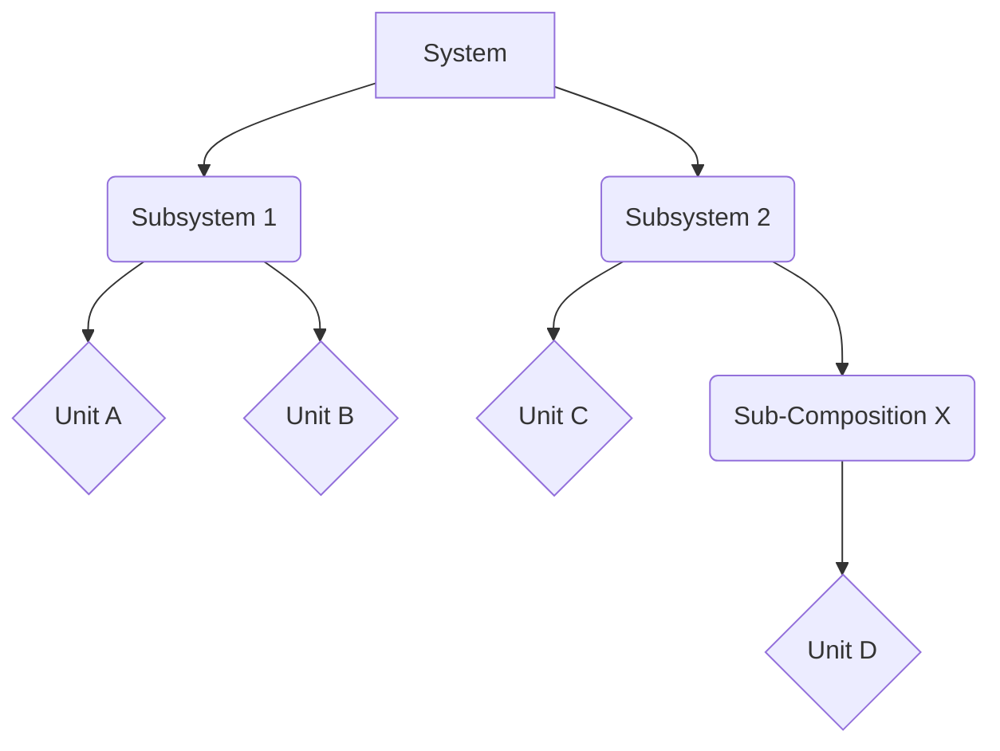

id: "composition-definition"
composition-type: "concept"
brief: "Definition of what constitutes a composition in MDMD"
---
A composition in MDMD represents conceptual groupings, interactions, and
architectural relationships between units and other compositions. Compositions
provide the structural context that organizes atomic units into coherent systems.

Compositions are designed to be:

- **Architectural**: Defining relationships and interactions between components
- **Hierarchical**: Organizing units and sub-compositions into logical groupings
- **Contextual**: Providing the conceptual framework for understanding units
- **Scalable**: Supporting recursive nesting and fractal organization patterns

Types of Compositions
---------------------
Compositions can be categorized based on their purpose and the nature of the
relationships they define. Common types include:

*   **Structural Compositions:** Define the static organization of components.
*   **Interaction Compositions:** Describe how components communicate or interact.
*   **Process Compositions:** Outline sequences of operations or workflows.

Composition Examples
--------------------

Composition Patterns
--------------------
Certain recurring patterns of composition are common in system design.

### Recursive Nesting
Compositions can contain other compositions, allowing for hierarchical
structuring of complex systems.

### Cross-Stratum Integration
Compositions can link units or concepts from different levels of abstraction
or different domains, facilitating a holistic view.

Guidelines for Writing Compositions
-----------------------------------
*   **Clarity of Purpose:** Each composition should have a clear, well-defined
    role.
*   **Appropriate Granularity:** Decompose systems to a level that balances
    detail with comprehensibility.
*   **Consistent Notation:** Use a consistent style for diagrams and textual
    descriptions (e.g., Mermaid for diagrams).
*   **Link to Units:** Clearly indicate which units are part of the composition
    and their roles within it.
